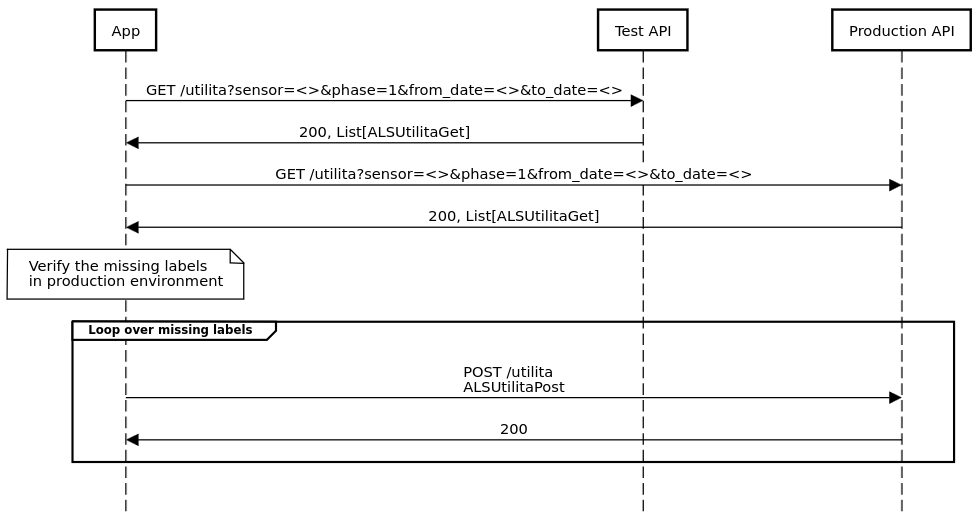

# Sync data between environments through API's call

This project aims to move the data from test database to production database.
Some entries could be repeated in the production database, so the algorithm should handle this inequality of data.

